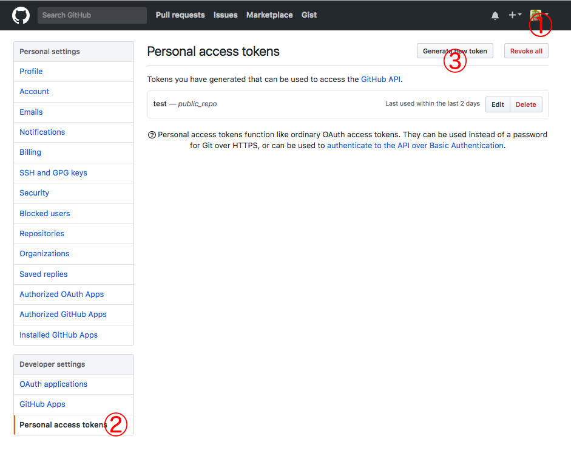
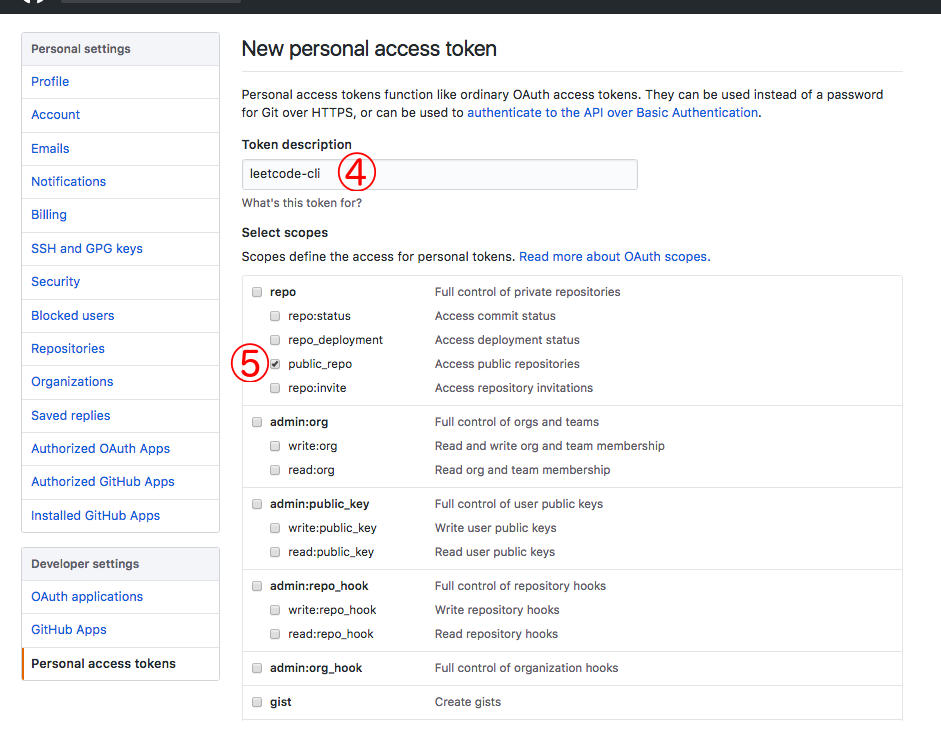

# github

Auto commit the accepted code to your own (public) GitHub repo.

## Requirement

* create an access token for your github repo.

## Config

* `repo`: your GitHub repo to persistent accpeted code.
* `token`: the access token to your repo, see [how to get token](#generate-token).

*Set Config*

	$ leetcode config plugins:github:repo <link of your repo>
	$ leetcode config plugins:github:token <your token>

*Unset Config*

	$ leetcode config -d plugins:github

*Example*

	{
		"plugins": {
			"github": {
				"repo": "https://github.com/skygragon/test",
				"token": "xxxxxxxxxxxxx"
			}
		}
	}

## Usage

	$ leetcode submit 001.two-sum.cpp
	  ✔ Accepted
	  ✔ 19/19 cases passed (6 ms)
	  ✔ Committed to https://github.com/skygragon/test
	  ✔ Your runtime beats 83.48 % of cpp submissions

## Tips

### Generate Token

As shown below, follow the steps:
`Settings` -> `Personal access tokens` -> `Generate new token` -> `public_repo` -> `Generate token`.

